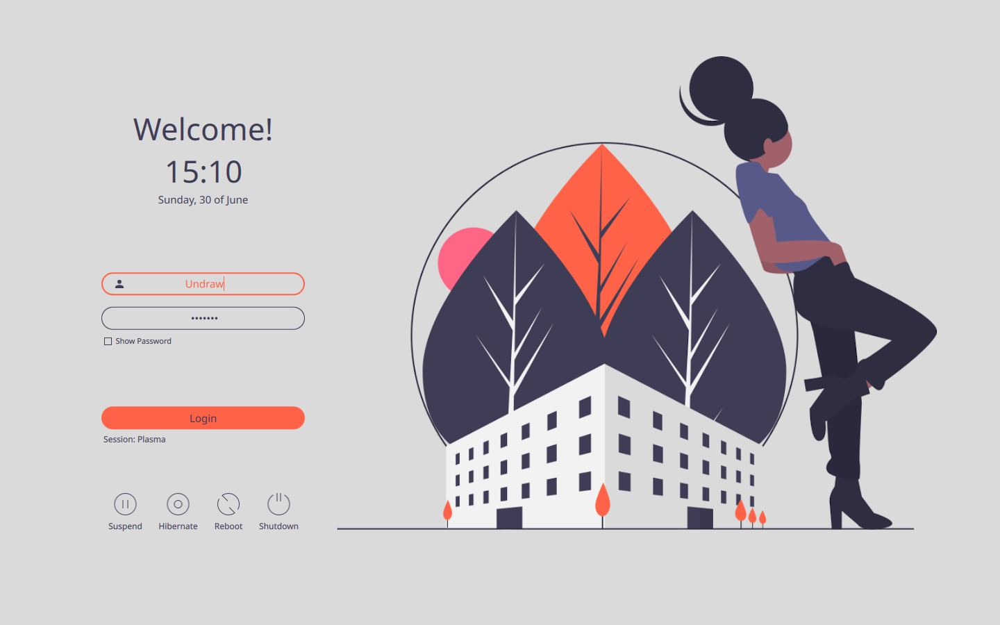
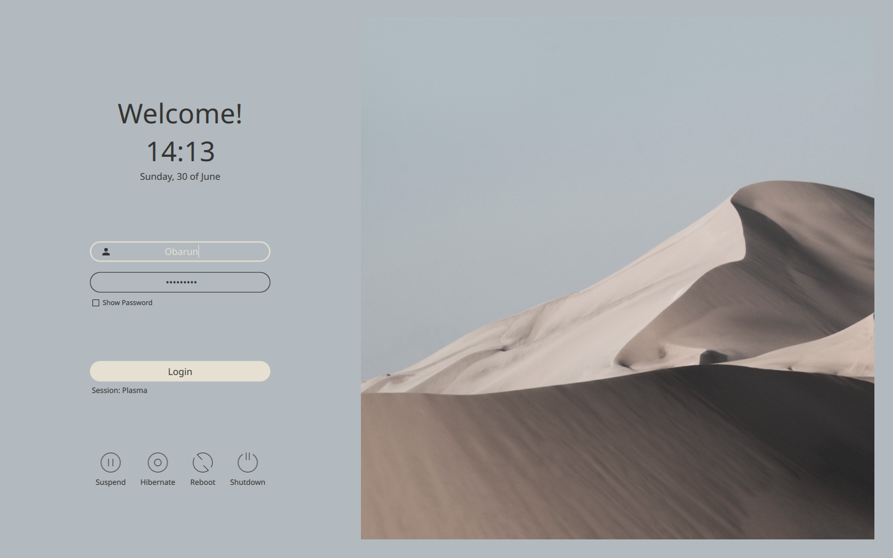
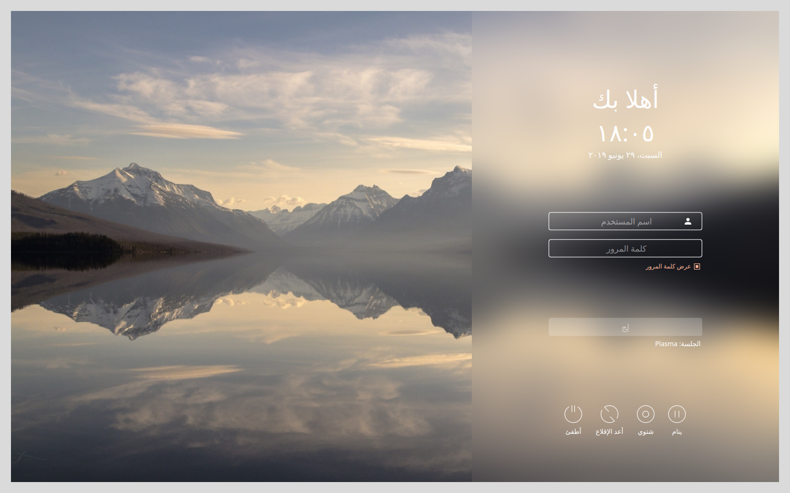
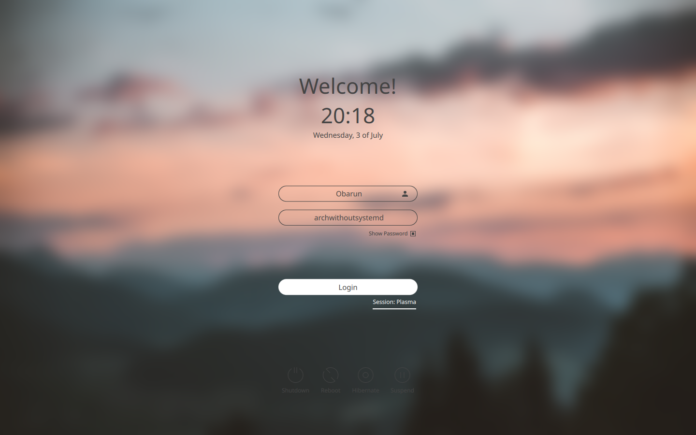
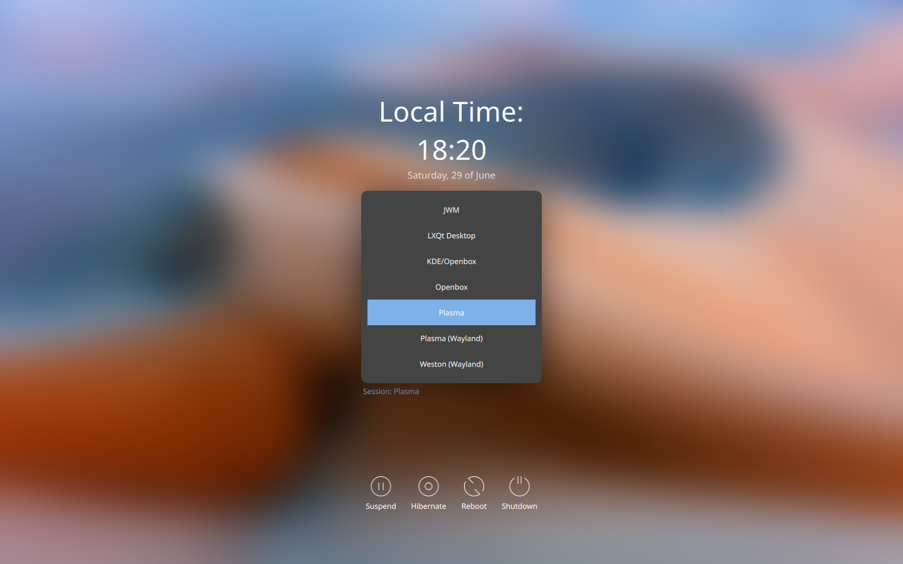

# Sugar Candy login theme for SDDM

You asked for more, you shall get it. Sugar Candy is the latest release in the Sugar series of SDDM themes. It's so extremely sweet your pancreas will have difficulties digesting its awesomeness.  

Sweeten the login experience for your users, your family and yourself. Sugar Candy works on almost all major distributions—see below—and focuses on a straight forward user experience and superb functionality while still offering vast customization possibilities.  

Sugar Candy is based on the Sugar series which was **written completely from scratch** making it clean and simple not only by looks but by design too.  
All controls use the [latest Qt Quick Controls 2](http://doc.qt.io/qt-5/qtquickcontrols2-index.html) for [increased performance](https://blog.qt.io/blog/2015/03/31/qt-quick-controls-for-embedded/) on low end or even embedded systems and beautiful color transitions.  

To learn how to control sugar levels read the section below about customization. There are **40 customizable variables** in total! This candy will be yours and only yours.

## Installation

#### From within KDE Plasma

If you are on [KDE Plasma](https://www.kde.org/plasma-desktop)—by default [Manjaro](https://manjaro.org/), [OpenSuse](https://www.opensuse.org/), [Neon](https://neon.kde.org/), [Kubuntu](https://kubuntu.org/), [KaOS](https://kaosx.us/) or [Chakra](https://www.chakralinux.org/) for example—you are lucky and can simply go to your system settings and under "Startup and Shutdown" followed by "Login Screen (SDDM)" click "Get New Theme". From there search for "Sugar Candy" and install.

If for some reason you cannot find the category named "Login Screen (SDDM)" in your system settings then you are missing the module `sddm-kcm`. Install this little helper with your package manager first. You will be grateful you did.

#### From other desktop environments

[Download the tar archive from opendesktop](https://www.opendesktop.org/p/1312658) and extract the contents to the theme directory of SDDM *(change the path for the downloaded file if necessary)*:
```
$ sudo mkdir -p /usr/share/sddm/themes
$ sudo tar -xzvf ~/Downloads/sugar-candy.tar.gz -C /usr/share/sddm/themes
```
This will extract all the files to a folder called "sugar-candy" inside of the themes directory of SDDM.  

After that you will have to point SDDM to the new theme by editing its config file, preferrably at `/etc/sddm.conf` *(create if necessary)*. You can take the default config file of SDDM as a reference: `/etc/sddm.conf/usr/lib/sddm/sddm.conf.d/sddm.conf`.  

In the `[Theme]` section simply add the themes name to this line: `Current=sugar-candy`. If you don't care for SDDM options and you had to create the file from blank just add these two lines and save it. Also see the [Arch wiki on SDDM](https://wiki.archlinux.org/index.php/SDDM).

#### Dependencies

[SDDM  >= 0.18](https://github.com/sddm/sddm) & [Qt5 >= 5.11](https://doc.qt.io/archives/qt-5.11/index.html)  
including: [`Qt Quick Controls 2`](https://doc.qt.io/archives/qt-5.11/qtquickcontrols2-index.html), [`Qt Graphical Effects`](https://doc.qt.io/archives/qt-5.11/qtgraphicaleffects-index.html), [`Qt SVG`](https://doc.qt.io/archives/qt-5.11/qtsvg-index.html), [`Qt Quick Layouts`](https://doc.qt.io/archives/qt-5.11/qtquicklayouts-index.html) each `>= 5.11`—*see below for distro specific package names*  

*Make sure these are installed with their required version or higher! SDDM might need an enabled system service/daemon to work. This is often done automatically during installation. Take note that a lot of standard release distros like Debian, Mint, MX, Elementary, Deepin or Ubuntu LTS are still on earlier versions. If in doubt ask in your distros forums.*  

**Debian based** distros using the **APT** package manager:  
*(Ubuntu/Kubuntu/Kali/Neon/antiX etc.)*  
`sudo apt install --no-install-recommends sddm qml-module-qtquick-layouts qml-module-qtgraphicaleffects qml-module-qtquick-controls2 libqt5svg5`

**Arch based** distros using the **pacman** package manger:  
*(Obarun/Artix/Manjaro/KaOS/Chakra etc.)*  
`sudo pacman -S --needed sddm qt5-graphicaleffects qt5-quickcontrols2 qt5-svg`  

**openSUSE** using the **zypper** package manager:
`sudo zypper install sddm libqt5-qtgraphicaleffects libqt5-qtquickcontrols2 libQt5Svg5 libQt5Svg5`

**Red Hat** based distros using the **dnf** package manager:  
*(Fedora/Mageia/RHEL/CentOS)*  
`sudo dnf install sddm qt5-qtgraphicaleffects qt5-qtquickcontrols2 qt5-qtsvg`

## Configuration

The sugar series is **extremely customizable** by editing its included `theme.conf` file. You can change the colors and images used, the time and date formats, the appearance of the whole interface and even how it works.  
And as if that wouldn't still be enough you can translate every single button and label because SDDM is still lacking behind with localization and clearly [needs your help](https://github.com/sddm/sddm/wiki/Localization)!

**Background="Backgrounds/Mountain.jpg"**  
*Path relative to the theme root directory. Most standard image file formats are allowed including support for transparency. (e.g. background.jpeg/illustration.GIF/Foto.png/undraw.svgz)*  

**DimBackgroundImage="0.0"**  
*Double between 0 and 1 used for the alpha channel of a darkening overlay. Use to darken your background image on the fly.*  

**ScaleImageCropped="true"**  
*Whether the image should be cropped when scaled proportionally. Setting this to false will fit the whole image instead, possibly leaving white space. This can be exploited beautifully with illustrations (try it with "undraw.svg" included in the theme).*  

**ScreenWidth="1440"**  
**ScreenHeight="900"**  
*Adjust to your resolution to help SDDM speed up on calculations.*  

**FullBlur="false"**  
**PartialBlur="false"**  
*Enable or disable the blur effect; if HaveFormBackground is set to true then PartialBlur will trigger the BackgroundColor of the form element to be partially transparent and blend with the blur.*  

**BlurRadius="100"**  
*Set the strength of the blur effect. Anything above 100 is pretty strong and might slow down the rendering time. 0 is like setting false for any blur.*  

**HaveFormBackground="false"**  
*Have a full opacity background color behind the form that takes slightly more than 1/3 of screen estate;  if PartialBlur is set to true then HaveFormBackground will trigger the BackgroundColor of the form element to be partially transparent and blend with the blur.*  

**FormPosition="center"**  
*Position of the form which takes roughly 1/3 of screen estate. Can be left, center or right.*  

**BackgroundImageHAlignment="center"**  
*Horizontal position of the background picture relative to its visible area. Applies when ScaleImageCropped is set to false or when HaveFormBackground is set to true and FormPosition is either left or right. Can be left, center or right; defaults to center if none is passed.*  

**BackgroundImageVAlignment="center"**  
*As before but for the vertical position of the background picture relative to its visible area.*  

**MainColor="white"**  
*Used for all elements when not focused/hovered etc. Usually the best effect is achieved by having this be either white or a very dark grey like #444 (not black for smoother antialias). Colors can be HEX or Qt names (e.g. red/salmon/blanchedalmond). See [https://doc.qt.io/qt-5/qml-color.html](https://doc.qt.io/qt-5/qml-color.html)*  

**AccentColor="#fb884f"**  
*Used for elements in focus/hover/pressed. Should be contrasting to the background and the MainColor to achieve the best effect.*  

**BackgroundColor="#444"**  
*Used for the user and session selection background as well as for ScreenPadding and FormBackground when either is true. If PartialBlur and FormBackground are both enabled this color will blend with the blur effect.*  

**OverrideLoginButtonTextColor=""**  
*The text of the login button may become difficult to read depending on your color choices. Use this option to set it independently for legibility.*  

**InterfaceShadowSize="6"**  
*Integer used as multiplier. Size of the shadow behind the user and session selection background. Decrease or increase if it looks bad on your background. Initial render can be slow for values above 5-7.*  

**InterfaceShadowOpacity="0.6"**  
*Double between 0 and 1. Alpha channel of the shadow behind the user and session selection background. Decrease or increase if it looks bad on your background.*  

**RoundCorners="20"**  
*Integer in pixels. Radius of the input fields and the login button. Empty for square. Can cause bad antialiasing of the fields.*  

**ScreenPadding="0"**  
*Integer in pixels. Increase or delete this to have a padding of color BackgroundColor all around your screen. This makes your login greeter appear as if it was a canvas. Cool!*  

**Font="Noto Sans"**  
*If you want to choose a custom font it will have to be available to the X root user. See https://wiki.archlinux.org/index.php/fonts#Manual_installation*  

**FontSize=""**  
*Only set a fixed value if fonts are way too small for your resolution. Preferrably kept empty.*  

**ForceRightToLeft="false"**  
*Revert the layout either because you would like the login to be on the right hand side or SDDM won't respect your language locale for some reason. This will reverse the current position of FormPosition if it is either left or right and in addition position some smaller elements on the right hand side of the form itself (also when FormPosition is set to center).*  

**ForceLastUser="true"**  
*Have the last successfully logged in user appear automatically in the username field.*  

**ForcePasswordFocus="true"**  
*Give automatic focus to the password field. Together with ForceLastUser this makes for the fastest login experience.*  

**ForceHideCompletePassword="false"**  
*If you don't like to see any character at all not even while being entered set this to true.*  

**Locale=""**  
*The time and date locale should usually be set in your system settings. Only hard set this if something is not working by default or you want a seperate locale setting in your login screen.*  

**HourFormat="HH:mm"**  
*Defaults to Locale.ShortFormat - Accepts "long" or a custom string like "hh:mm A". See http://doc.qt.io/qt-5/qml-qtqml-date.html*  

**DateFormat="dddd, d of MMMM"**  
*Defaults to Locale.LongFormat - Accepts "short" or a custom string like "dddd, d 'of' MMMM". See http://doc.qt.io/qt-5/qml-qtqml-date.html*  

**HeaderText="Welcome!"**  
*Header can be empty to not display any greeting at all. Keep it short.*  

*SDDM may lack proper translation for every element. Sugar defaults to SDDM translations. Please help translate SDDM as much as possible for your language: https://github.com/sddm/sddm/wiki/Localization. These are in order as they appear on screen.*  

**TranslatePlaceholderUsername=""**  
**TranslatePlaceholderPassword=""**  
**TranslateShowPassword=""**  
**TranslateLogin=""**  
**TranslateLoginFailedWarning=""**  
**TranslateCapslockWarning=""**  
**TranslateSession=""**  
**TranslateSuspend=""**  
**TranslateHibernate=""**  
**TranslateReboot=""**  
**TranslateShutdown=""**  
*These don't necessarily need to translate anything. You can enter whatever you want here.*  

## Examples
These are some previews of configurations possible with Sugar Candy.






## Legal Notice

Copyright (C) 2018 Marian Arlt.  

Sugar Candy is free software: you can redistribute it and/or modify it under the terms of the GNU General Public License as published by the Free Software Foundation, either version 3 of the License, or (at your option) any later version.  

Sugar Candy is distributed in the hope that it will be useful, but WITHOUT ANY WARRANTY; without even the implied warranty of MERCHANTABILITY or FITNESS FOR A PARTICULAR PURPOSE. See the GNU General Public License for more details.  

You should have received a copy of the GNU General Public License along with Sugar Candy. If not, see <https://www.gnu.org/licenses/>.

### Other awesome projects

- [Chili—the hottest login theme for KDE Plasma](https://www.opendesktop.org/p/1214121)
- [Chili stand-alone fork for SDDM only](https://www.opendesktop.org/p/1240784)
- [Flat OSX like aurorae window decorations for your Linux desktop](https://www.opendesktop.org/p/1199822) and [its high contrast version](https://www.opendesktop.org/p/1246756)
- [Finely crafted folder icons for Linux](https://www.opendesktop.org/p/1228310)
- [Inline clock widget for KDE Plasma](https://www.opendesktop.org/p/1245902)

### Motivate a developer

In the past years I have spent quite some hours on open source projects. If you are the type of person who digs attention to detail, know how much work is involved in it and/or simply likes to support makers with a coffee or a beer I would greatly appreciate your donation on my [PayPayl](https://www.paypal.me/marianarlt) account.  
Alternatively downloading my themes directly from opendesktop or with the kde sddm system settings module will at least help me a little to be able to attend your issues and requests.  
Please consider helping developers you think are worth a penny or two, literally.
